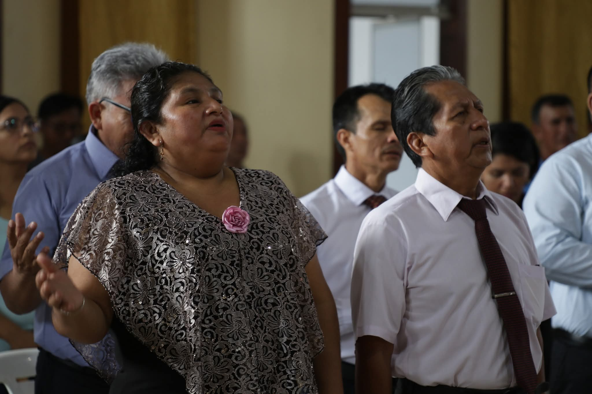

# Iglesia Evangélica de Puerto Maldonado

_**Jesús te ama y tiene un propósito para tu vida.**_
*Él vino a traer luz donde hay oscuridad, consuelo donde hay dolor y esperanza donde parece no haber salida. En cada paso de la vida, Dios desea caminar contigo, guiarte con Su Palabra y llenarte de Su paz. Si sientes el deseo de acercarte más a Él, este es el momento. Abre tu corazón, porque Cristo está llamando. Su amor puede transformar tu historia y darte una vida nueva.*

_(Ejemplo de Versículo que se actualiza diariamente)  "Porque de tal manera amó Dios al mundo, que ha dado a su Hijo unigénito, para que todo aquel que en él cree, no se pierda, mas tenga vida eterna" Juan 3:16_

## Visión
_Ser una iglesia llena del Poder del Espíritu Santo, constantes en oración y ayuno. Ser una iglesia misionera como iglesia Madre "Rescatando lo Perdido"_

## Misión

_Buscar la llenura del Espíritu Santo. Discipular a los nuevos creyentes en Cristo. Que a través de las misiones y el evangelismo (visitas a hospitales, campañas evangelísticas, a través de servicios sociales, etc.) alcancemos las buenas nuevas a la población de esta ciudad_

## Pastor y esposa
- Segundo Pedro Sanchez Grifa y Karina Yucra Salas
- 

## Horarios
- Martes (7:00PM - 8:30PM): Culto de Oración
- Jueves (7:00PM - 8:30PM): Estudio Bíblico
- Sábado (7:15PM - 8:30PM): Culto de Jóvenes
- Domingo (10:00AM - 12:00PM || 7:00PM - 8:30PM)

### ¿Necesitas ayuda?
Si estás pasando por momentos difíciles, si te sientes solo, cansado o sin rumbo, queremos decirte que hay esperanza.

En nuestra iglesia encontrarás personas dispuestas a escucharte, orar contigo y acompañarte.
No tienes que enfrentar tus luchas solo: Jesús te ama y quiere ayudarte a levantarte.
[Contáctanos](/Contactos.md)

### "La mies es mucha pero los obreros pocos" Mateo xxx
Si sientes en tu corazón colaborar o donar para apoyar en nuestra obra. Escríbenos.
- Agregamos buzón de mensajes